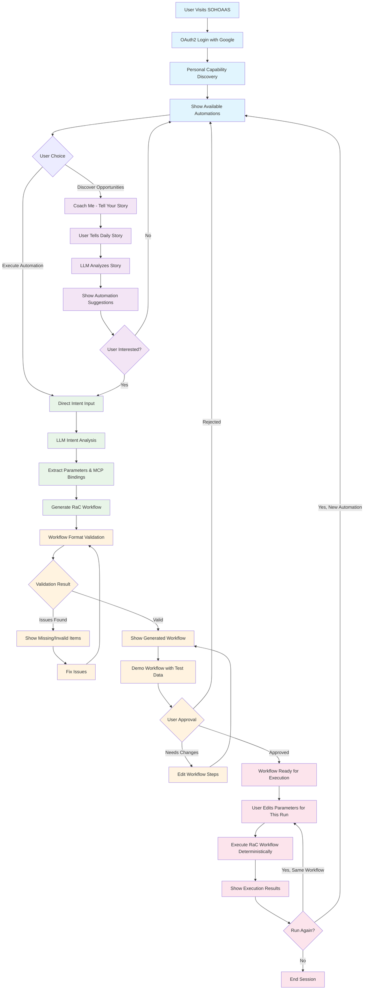

# SOHOAAS User Workflow

This diagram shows the complete user journey through the SOHOAAS system, from authentication to workflow execution.

## Key Workflow Phases

### 🔐 **Authentication & Discovery**
- OAuth2 login with Google services
- Discover user's personal automation capabilities
- Show available automations based on connected services

### 🎓 **Coaching Mode (Optional)**
- User tells their daily story naturally
- LLM identifies automation opportunities
- Suggests relevant workflows to create

### 🧠 **Intent Processing**
- User expresses automation intent
- LLM analyzes and extracts parameters
- Generates executable RaC workflow

### ✅ **Validation & Approval**
- Validate workflow format and completeness
- Demo workflow with user's test data
- User approves or requests modifications

### ⚡ **Execution & Reuse**
- User edits parameters for each run
- Execute workflow deterministically
- Reuse same workflow with different parameters

## User Experience Highlights

- **Personal**: Uses user's own Google accounts and data
- **Guided**: Capability discovery shows what's possible
- **Natural**: Story-based coaching for opportunity discovery
- **Transparent**: User sees and approves generated workflows
- **Reusable**: Same workflow can be run multiple times with different parameters
- **Deterministic**: Reliable execution with clear results
