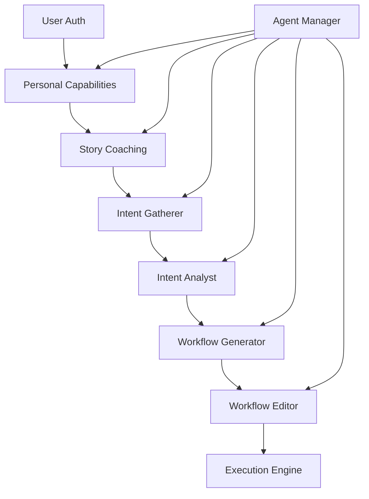

# SOHOAAS Multi-Agent Architecture

## Overview

This directory contains the RaC specifications for SOHOAAS's multi-agent architecture. Each agent is autonomous, event-driven, and follows the three-layer RaC model:

- **Layer 1 (Requirements)**: States, events, logic, UI, tests - what the agent should do
- **Layer 2 (Architecture)**: System structure, components, communication patterns - how it's organized  
- **Layer 3 (Implementation)**: Technology bindings, deployment configs - what technologies to use

## Agent Responsibilities

### 🎯 Agent Manager (`agent_manager.cue`)
- **Type**: Deterministic Orchestrator
- **Role**: Event routing, state transitions, agent coordination
- **Key Feature**: No LLM decisions - purely rule-based orchestration

### 🔍 Personal Capabilities Agent (`personal_capabilities.cue`)
- **Type**: Autonomous Agent
- **Role**: Discover user's connected services and map to available actions
- **Triggers**: User authentication
- **Output**: Available capabilities and usage examples

### 💬 Intent Gatherer Agent (`intent_gatherer.cue`)
- **Type**: Autonomous Agent  
- **Role**: Extract actionable intent from natural language
- **Triggers**: User messages
- **Output**: Classified intent with entities and confidence

### 🔬 Intent Analyst Agent (`intent_analyst.cue`)
- **Type**: Autonomous Agent
- **Role**: Deep analysis and validation of extracted intents
- **Triggers**: Intent extraction completion
- **Output**: Validated workflow parameters and complexity assessment

### ⚙️ Workflow Generator Agent (`workflow_generator.cue`)
- **Type**: Autonomous Agent
- **Role**: Generate complete RaC workflows from validated intents
- **Triggers**: Intent validation completion
- **Output**: Complete RaC workflow definitions with MCP bindings

## Event-Driven Communication



## Genkit Integration

Each agent is implemented as a Genkit Flow with the following structure:

```go
// Example: Personal Capabilities Agent
func PersonalCapabilitiesFlow() *genkit.Flow {
    return genkit.DefineFlow("personal-capabilities", func(ctx context.Context, input CapabilityRequest) (*CapabilityResponse, error) {
        // Step 1: Query MCP servers
        servers := queryMCPServers(input.UserID, input.OAuthTokens)
        
        // Step 2: Map service actions
        actions := mapServiceActions(servers)
        
        // Step 3: Generate examples using LLM
        examples := generateExamples(ctx, actions, input.UserContext)
        
        // Emit event for next agent
        eventBus.Emit("capabilities_discovered", CapabilityResponse{
            UserID: input.UserID,
            MCPServers: servers,
            AvailableActions: actions,
            Examples: examples,
        })
        
        return &response, nil
    })
}
```

## Key Design Principles

### 1. **Autonomous Agents**
- Each agent operates independently
- Makes decisions within its domain
- Communicates only through events

### 2. **Deterministic Orchestration**
- Agent Manager uses rule-based routing
- No LLM decisions in orchestration layer
- Predictable system behavior

### 3. **Event-Driven Architecture**
- Loose coupling between agents
- Scalable and resilient
- Easy to add new agents

### 4. **Three-Layer RaC Model**
- Clear separation of concerns
- Technology-agnostic requirements
- Flexible implementation choices

## Deployment

Each agent deploys as a separate microservice:

```yaml
# Kubernetes deployment example
apiVersion: apps/v1
kind: Deployment
metadata:
  name: intent-gatherer-agent
spec:
  replicas: 3
  selector:
    matchLabels:
      app: intent-gatherer
  template:
    spec:
      containers:
      - name: intent-gatherer
        image: sohoaas/intent-gatherer:latest
        ports:
        - containerPort: 8082
        env:
        - name: OPENAI_API_KEY
          valueFrom:
            secretKeyRef:
              name: openai-secret
              key: api-key
```

## Benefits of This Architecture

### ✅ **Scalability**
- Scale agents independently based on load
- Add new agents without system changes
- Horizontal scaling per agent type

### ✅ **Maintainability**  
- Clear agent boundaries and responsibilities
- Independent development and deployment
- Easy to debug and monitor

### ✅ **Flexibility**
- Swap agent implementations
- Different LLM models per agent
- Technology diversity where beneficial

### ✅ **Reliability**
- Agent failures don't cascade
- Event-driven resilience
- Deterministic orchestration reduces complexity

## Next Steps

1. **Implement Agent Manager** - Start with the deterministic orchestrator
2. **Build Core Agents** - Implement each agent as Genkit flows
3. **Event Bus Setup** - Configure event routing and messaging
4. **Integration Testing** - Test complete user journeys
5. **Monitoring Setup** - Add observability and metrics

This architecture aligns perfectly with your vision of autonomous, event-driven agents orchestrated deterministically, while leveraging Genkit's flow-based LLM integration capabilities.
